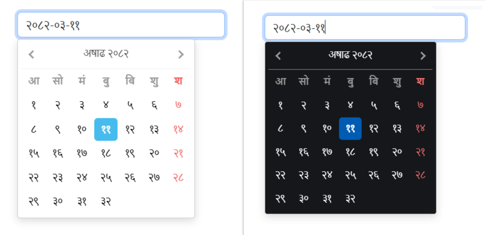

<h1 align="center">Welcome to Angular Nepali DatePicker Calendar 👋</h1>
<p>
  
    
  </a>
  <a href="https://github.com/rishov21/angular-nepali-datepicker/graphs/commit-activity" target="_blank">
    
  </a>
  <a href="https://github.com/rishov21/angular-nepali-datepicker/blob/master/LICENSE" target="_blank">
    
  </a>
  <a href="https://www.buymeacoffee.com/rishovthapa" target="_blank">
    
  </a>
  <a href="https://www.linkedin.com/in/rishov-thapa/" target="_blank">
    
  </a>
  <a href="https://www.npmjs.com/package/@rishovt/angular-nepali-datepicker" target="_blank">
    
  </a>
</p>


> A lightweight, customizable Angular wrapper, build around JS with support for Unicode-rendered Nepali dates for both Reactive Forms and ngModel and flexible date formats. Ideal for forms requiring calendar-based Nepali inputs as well as AD-BS and BS-AD conversions.



## ✨ [Live Demo](https://rishov21.github.io/angular-nepali-datepicker-demo/)

### 🏠 [NPM Package](https://www.npmjs.com/package/@rishovt/angular-nepali-datepicker)

## Prerequisites

To use @rishovt/angular-nepali-datepicker, make sure your project meets the following requirements

✅ Angular Compatibility
- Supports both View Engine and Ivy compilation modes.

📦 Peer Dependencies
Make sure the following are available in your project:
- @angular/core
- @angular/forms
- zone.js
- tslib
  
These are usually already installed in any standard Angular app.

### ✨ Features
- 📅 Nepali Date Support: Handle dates as both JavaScript objects and strings seamlessly.
- 🔀 Dual Build Support: Compatible with both Angular View Engine and Ivy compilation modes.
- 🔄 Date Conversion: Easily convert dates between Bikram Sambat (BS) and Gregorian (AD) calendars.
- 🛠️ Custom Date Formats: Flexible configuration to display dates in your preferred formats.
- ✅ Angular Forms Integration: Full support for both reactive and template-driven forms.
- ⚙️ Additional Utilities: Includes handy functions like number-to-word conversion, Unicode handling, and more.
- 🎯 Easy to Use: Designed with simplicity in mind for quick integration and minimal setup.
- 📱 Responsive & Lightweight: Optimized for performance and mobile-friendly design with Dark mode support
- 🔧 Well-Maintained: Regular updates and active support to keep your app running smoothly.

<a href="https://rishov21.github.io/angular-nepali-datepicker-demo/documentation" style="color:#007acc;font-weight:bold;font-size:16px;" target="_blank">
    🌐 View Documentation
</a>

## 💡 Installation

The package can be installed via npm:
```sh
npm i @rishovt/angular-nepali-datepicker --save
```

Or via yarn:
```sh
yarn add @rishovt/angular-nepali-datepicker
```

## 🚀 Usage

1. 📦 Module Imports
```ts
import { RtcNepaliDatePickerModule } from '@rishovt/angular-nepali-datepicker';

@NgModule({
  imports: [
    RtcNepaliDatePickerModule
  ]
})
export class AppModule {}
``` 
2. 🌐 Angular JSON 
   
   You need to add the following to your angular.json file for the consumer to be able to know the js and css paths:
```json
"assets": 
[
    {
        "input": "./node_modules/@rishovt/angular-nepali-datepicker/assets",
        "glob": "**/*",
        "output": "/assets"
    }
]
```   
3. 🧩 Component Usage

```html
<rtc-nepali-datepicker
  *ngIf="datepickerOptions"
  [options]="datepickerOptions"
  [value]="selectedDate"
  [pickerId]="inputId"
  (dateChange)="onDateSelect($event)">
</rtc-nepali-datepicker>
```
```ts
inputId = 'nepali-datepicker'; // unique id for the datepicker, recommended to append with nepali-datepicker + randomId
public selectedDate: DateObject;
datepickerOptions = {
    classes: `form-control ${this.disabled ? 'np-date-picker-disabled' : ''}`,
    placeholder: "Select Date",
    dateFormat: 'YYYY-MM-DD',
    closeOnDateSelect: true,
    minDate: { year: 1800, month: 1, day: 1 },
    maxDate: null,
    disabled: false,
};

onDateSelect(event : DateObject) {
    this.selectedDate = event;
    console.log('Selected Date Object:', this.selectedDate);
}
```
 <a href="https://rishov21.github.io/angular-nepali-datepicker-demo/supported-options" style="color:#007acc;font-weight:bold;" target="_blank">
    🔗 Click here for full list of available options → <br>
    🌐 Visit the main website for examples
</a><br><br>

5. 🛠 Nepali Datepicker Service
```ts
import { NepaliDatepickerService } from '@rishovt/angular-nepali-datepicker';

constructor(private dateService: RtcNepaliDatepickerService) {}

private async basicNepaliDateService() {
    const bsDateObject: DateObject = await this.dateService.BSGetCurrentDate();
    const adDateObject: DateObject = await this.dateService.ADGetCurrentDate();
    console.log(bsDateObject); // e.g., { year: 2078, month: 10, day: 14, value: '2078-10-14' }
    console.log(adDateObject); // e.g., { year: 2022, month: 3, day: 14, value: '2022-03-14' }
    
    // Convert AD to BS, and vice versa
    const bsDateString: any = await this.nepaliService.AD2BS(this.adDateString, this.options.dateFormat);
    const adDateString: any = await this.nepaliService.BS2AD(this.bsDateString, this.options.dateFormat);
  }
  
private setDate(dateId: string, date: string) {
    this.nepaliService.setDate(this.inputId, bsDateString);
}
```

## 🙋‍♂️ About the Author

Made with ❤️ by [Rishov Thapa](https://www.linkedin.com/in/rishovthapa/)<br>
I'm a passionate developer focused on building clean, efficient, and practical tools for real-world projects.  
If you find this package helpful, feel free to:

- ⭐ Star the repo to show support
- 🤝 Connect with me on [LinkedIn](https://www.linkedin.com/in/rishov-thapa/)
- 🧑‍💻 Follow me on [GitHub](https://github.com/rishov21)
- ☕ [Buy me a coffee](https://www.buymeacoffee.com/rishovthapa) if you’d like to support future development

<p align="left">
  <a href="https://www.buymeacoffee.com/rishovthapa" target="_blank">
    
  </a>
</p>


## 🙏 Credits
This library internally uses the JavaScript and CSS assets from [sajanm/nepali-date-picker](https://github.com/sajanm/nepali-date-picker).  
All credits for the original date picker logic and javascript goes to the original author.

---
This project is not affiliated with or endorsed by the original authors of the `nepali-date-picker` library.

## 🤝 Contributing

Contributions, issues and feature requests are welcome!<br />Feel free to check [issues page](https://github.com/rishov21/angular-nepali-datepicker/issues). You can also take a look at the [contributing guide](https://github.com/rishov21/angular-nepali-datepicker/blob/master/CONTRIBUTING.md).

## 📝 License

Copyright © 2025 [Rishov Thapa Chhetri <rishov096@gmail.com>](https://github.com/rishov21).<br />
This project is [MIT](https://github.com/rishov21/angular-nepali-datepicker/blob/master/LICENSE) licensed.

***